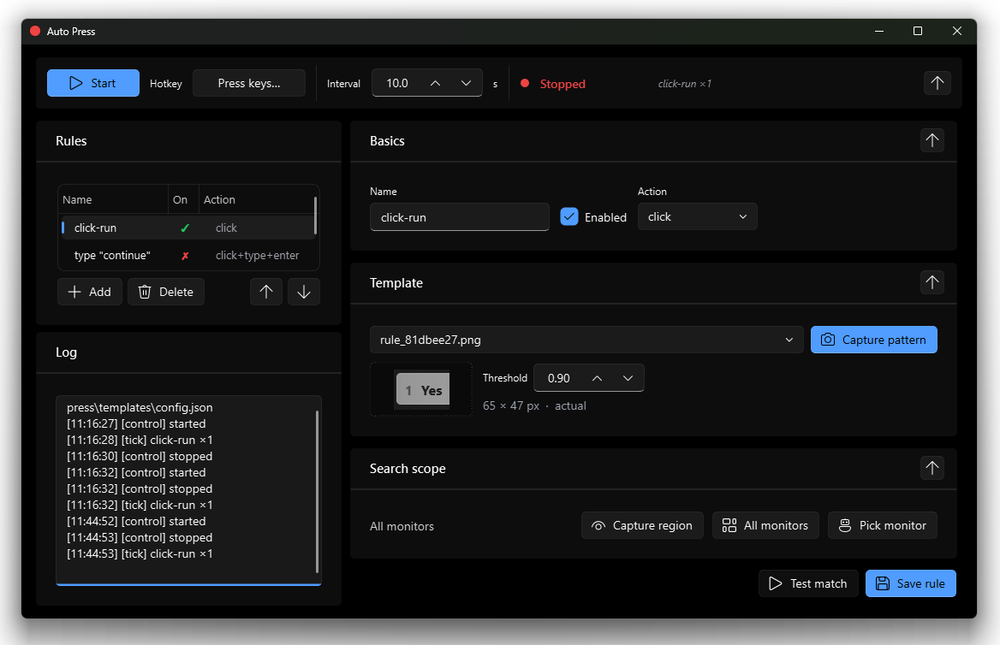

# 🖱️ auto-press

[](https://www.python.org/)
[](#-faq)
[](https://github.com/astral-sh/uv)
[](#)

**Automate LLMs that run outside of sandboxes — no containers, no APIs, just your screen.**

auto-press was built to keep [Cursor](https://cursor.com/) agents moving without babysitting. Sandboxes take time to spin up and don't work for every workflow; if you already have a Cursor window open, this tool watches it, clicks the right button, and keeps the agent running on its own. It's fast, local, and it works on anything you can see on your screen.

<p align="center">
  
</p>

## ✨ Why

- 🧠 **Built for LLM agents** — keeps Cursor loops unblocked while you do other work.
- 🖥️ **No sandbox required** — if you can see it, auto-press can click it.
- ⚡ **Fast** — configurable scan interval and search region.
- 🎯 **Template-matching rules** — screenshot the button once, forget about it.
- 🌙 **Runs overnight** — types `continue` whenever the agent stalls so it works while you sleep.
- 🔕 **Stays out of the way** — lives in the system tray with a red/green status dot.

## 🚀 Quickstart

Install [uv](https://github.com/astral-sh/uv), then:

```bash
uv sync
uv run main.py
```

That's it — the UI opens and you're ready to add your first rule.

The project pins **Python 3.14** via `.python-version`; `uv sync` will fetch it automatically. The code itself supports Python 3.10+ if you want to use something older — just delete `.python-version` or run `uv python pin 3.11` (or whichever version you'd like).

## 🧭 The workflow

Each rule is a few clicks:

1. **Add a rule.** Name it and toggle it on.
2. **Pick an action.** Click, click + Enter, or click + send (send = type a word, then Enter).
3. **Capture the target.** A crop of the button — triggers the rule; the cursor clicks its center.
4. **Test & Save.** Run a single match to confirm, then save.
5. **Press Page Down** to start / stop. The window can stay in the background or hide to the tray.

## 🟢🔴 Tray indicator

auto-press sits in the Windows system tray. The dot color tells you what it's doing:

<table>
  <tr>
    <td align="center"><br><strong>Stopped</strong><br><sub>not scanning</sub></td>
    <td align="center"><br><strong>Running</strong><br><sub>scanning &amp; firing rules</sub></td>
  </tr>
</table>

Left-click the icon to show/hide the window. Right-click for Start/Stop and Quit.

## 📦 Standalone executable

If 5 s Python startup bothers you, build a Nuitka-compiled single exe:

```bash
uv run python -m nuitka \
  --onefile \
  --enable-plugin=pyside6 \
  --include-package=qfluentwidgets \
  --include-package=qframelesswindow \
  --include-package=cv2 --include-package=PIL --include-package=numpy --include-package=pyautogui \
  --noinclude-qt-translations --lto=yes \
  --output-dir=dist --output-filename=auto-press.exe \
  --assume-yes-for-downloads \
  main.py
```

First invocation downloads a MinGW toolchain (~200 MB, cached). Output lands in `dist/auto-press.exe` — a single binary, no Python required on the target machine. Double-click to launch; subsequent runs are much snappier than `uv run`.

> Qt ships `pyside6-deploy` as a higher-level wrapper, but it currently fails on paths with spaces (e.g. `OneDrive - …`); driving Nuitka directly works either way.

## ❓ FAQ

<details>
<summary><strong>How do I keep the tray icon always visible on Windows?</strong></summary>

By default Windows hides new tray icons inside the `^` overflow flyout. Windows doesn't let apps force the icon to be pinned — it's a per-user setting you toggle once:

- **Windows 11**: Settings → Personalization → Taskbar → *Other system tray icons* → turn on `Auto Press` (or `python.exe` while the app is running).
- **Windows 10**: Settings → Personalization → Taskbar → *Select which icons appear on the taskbar* → turn on `Auto Press`.

After that, the red/green dot stays next to the clock whenever auto-press is running.
</details>

<details>
<summary><strong>What's the scan interval and why does it matter?</strong></summary>

The interval (seconds) controls how often auto-press captures the screen and tests the active rules. Lower = more responsive, higher = less CPU. You can also restrict the search region per rule so scans are cheap even at sub-second intervals.
</details>

<details>
<summary><strong>Does this work on macOS or Linux?</strong></summary>

Today auto-press is **Windows-only in practice**. The engine, UI, and template matching are cross-platform (PySide6 + Pillow + OpenCV run everywhere), but three pieces lean on Win32 APIs:

- Per-monitor-v2 DPI awareness for reliable capture across mixed-DPI monitors.
- Physical-pixel cursor and monitor enumeration (`GetCursorPos`, `EnumDisplayMonitors`).
- Global **Page Down** hotkey (`RegisterHotKey`).

macOS / Linux parity is on the roadmap but **low priority** — happy to pick it up if someone finds it useful. Contributions welcome; the three items above are all that'd need writing, the rest already works.

</details>

<details>
<summary><strong>My template matches on one monitor but not another.</strong></summary>

The two monitors are probably at different DPI scalings. Template matching is not scale-invariant — a button rendered at 100% looks pixel-different from the same button at 150%. Either capture the template on the monitor you want to match on, or set both monitors to the same Windows display scaling.
</details>

## 🧩 Advanced

<details>
<summary><strong>CLI & hotkeys</strong></summary>

```bash
uv run main.py [seconds]
```

- `seconds` (optional) — default scan interval; can also be edited live in the UI. Default: `10.0`.
- **Page Down** (Windows) — global hotkey to Start/Stop without focusing the window.
- **Ctrl+C** (terminal) — clean shutdown.

Per-rule matching options (template, threshold, search region, action, optional text) all live in the UI.
</details>

<details>
<summary><strong>Code layout</strong></summary>

- [main.py](main.py) — entrypoint, forces per-monitor-v2 DPI and installs a SIGINT handler
- [press_ui.py](press_ui.py) — Fluent-Design UI, engine worker thread, per-monitor capture overlays, tray icon
- [press_engine.py](press_engine.py) — screen capture + template matching + action dispatch
- [press_store.py](press_store.py) — config and template persistence
- [press_core.py](press_core.py) — click / type / vision primitives
- [templates/](templates/) — captured template images and `config.json`
- [pysidedeploy.spec](pysidedeploy.spec) — Nuitka config for the standalone-exe build
</details>
